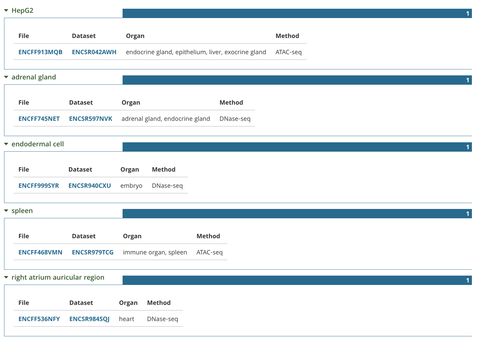
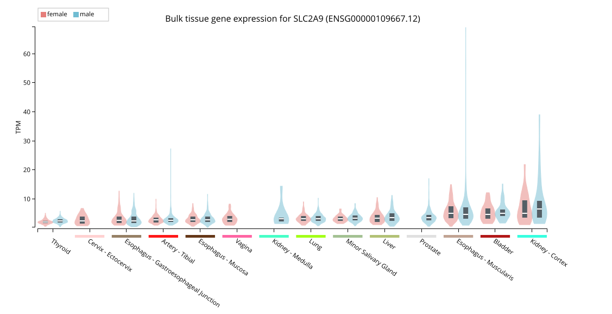

## The Data

```{r}
library(ComplexHeatmap)
library(circlize)
load("project1_save.RData")
load("project2_save.RData")
load("project3_save.RData")
load("project4_save.RData")
clinical <- read.csv("Clinical_Urate.csv")
colnames(clinical) <- c(
  "ID",
  "Age",
  "Sex",
  "Alcohol",
  "BMI",
  "Diuretic",
  "Physical_Activity",
  "Serum_Urate"
)
```

```{r}
library(DT)

datatable(
  clinical,
  options = list(
    scrollX = TRUE,
    pageLength = 5,
    autoWidth = TRUE
  ),
  rownames = FALSE
)
```

## Variables

-   **ID**: unique participant identifier `|character|`\
-   **Age**: age at enrollment `|numeric|`\
-   **Sex**: biological sex (1 = male, 2 = female) `|factor|`\
-   **Alcohol**: drinks per week `|numeric|`\
-   **BMI**: body mass index `|numeric|`\
-   **Diuretic**: diuretic use (0 = no, 1 = yes) `|factor|`\
-   **Physical_Activity**: minutes per week `|numeric|`\
-   **Serum_Urate**: blood urate level (mg/dL) `|numeric|`

## The Trait

```{r}

library(ggplot2)
library(dplyr)
library(hrbrthemes)

clinical$Sex <- factor(
  clinical$Sex,
  levels = c(1, 2),
  labels = c("Male", "Female")
)

histp <- clinical %>%
  ggplot(aes(x = Serum_Urate, fill = Sex)) +
  
  theme(
    legend.position = "top"
  )+
  
  geom_histogram(
    color = "#e9ecef",
    alpha = 0.6,
    position = "identity",
    bins = 30
  ) +
  
  # Umbral hombres
  geom_vline(
    xintercept = 7,
    color = "#4895ef",
    linetype = "dashed",
    linewidth = 1.2
  ) +
  
  # Umbral mujeres
  geom_vline(
    xintercept = 6,
    color = "#ff0054",
    linetype = "dashed",
    linewidth = 1.2
  ) +
  
  scale_fill_manual(values = c("#780000", "#390099")) +
  theme_ipsum() +
  labs(fill = "")+

  annotate("text", x = 7, y = 50,
         label = "Men", color = "#001524", angle = 90)+

  annotate("text", x = 6, y = 100,
         label = "Women", color = "#001524", angle = 90, fontface = "bold") +
  annotate("text", x = 1, y = 100,
         label = "Hiperucemia Individuals ~ 27", color = "#001524", angle = 0, fontface = "bold")


ggsave("histogram.png", histp, 
       width = 10, height = 8, dpi = 300)


```

```{r fig.width=10, fig.height=6, fig.cap="Distribution of serum urate levels stratified by sex. Dashed vertical lines indicate commonly used clinical thresholds for hyperuricemia. (Age range: 22-87) (Females = 464, Males = 937)"}
histp
```

## QC Metrics: Minor Allele Frequency

A minor allele frequency (MAF) filter was applied to remove SNPs with very low allele frequency. Variants with low MAF contribute limited information for association testing and may lead to unstable effect estimates due to insufficient representation of the minor allele.

::: callout-warning
SNPs with very low MAF are often excluded because they provide low statistical power and can produce unreliable regression estimates in small samples.
:::

The MAF threshold was set to 0.01, meaning that SNPs with a minor allele frequency below 1% were excluded from downstream analyses.

## QC Metrics: Minor Allele Frequency

```{r fig.cap="Distribution of MAF across SNPs. The dashed line indicates the filtering threshold at MAF = 0.01. 77401 SNPs will be removed due to low MAF (442,599 SNPs remain.)."}
print(maf_plot)
```

## QC Metrics: Heterozygosity

First, a **heterozygosity-based** inbreeding coefficient ((F)-statistic) was calculated to assess potential sample quality issues and deviations from expected heterozygosity.

::: callout-warning
Excess or deficient heterozygosity across typed SNPs within an individual is commonly considered indicative of inbreeding, contamination, or poor sample quality.
:::

Expected heterozygosity was estimated as:

$$
E = 2 \times MAF \times (1 - MAF)
$$

## QC Metrics: Heterozygosity

Observed heterozygosity was calculated as:

$$
O = \text{Heterozygosity} \times n_{\text{SNPs}} \times \text{Call Rate}
$$

The inbreeding coefficient was then computed as:

$$
F = 1 - \frac{O}{E}
$$

## QC Metrics: Heterozygosity

```{r fig.cap="8 individuals will be removed due to low sample call rate or unusual F coefficient. (1393 Individuals Remain)"}
print(Distribution_of_Heterozygosity)
```

## QC Metrics: Sample Call Rate

To assess genotype completeness across individuals, a sample call rate filter was applied. Sample call rate represents the proportion of successfully genotyped SNPs for each individual.

::: callout-warning
Individuals with high levels of missing genotype data may reflect poor DNA quality, genotyping failure, or sample processing issues and can introduce bias into downstream analyses.
:::

Samples with call rates below 97% were excluded from downstream analyses.

## QC Metrics: Sample Call Rate

```{r fig.cap="218 individuals will be removed due to low sample call rate or unusual F coefficient. (1183 Individuals Remain)"}
print(callrate_plot)
```

## QC Metrics: Hardy-Weinberg Equilibrium

Hardy-Weinberg equilibrium (HWE) testing was performed as an additional genotype quality control step. Deviations from HWE may indicate genotyping errors, population stratification, or technical artifacts.

In classical case-control GWAS designs, HWE testing is typically performed using controls only, since disease-associated loci may naturally deviate from equilibrium among affected individuals.

## QC Metrics: Hardy-Weinberg Equilibrium

Because serum urate is a continuous phenotype and no true control group exists in this dataset, a pseudo-control subset was defined using individuals within the central distribution of serum urate values (1st-99th percentile). This strategy was intended to reduce the influence of extreme phenotype values while preserving most of the cohort for equilibrium estimation.

SNPs showing strong deviation from HWE $p < 10^{-6}$ were excluded from downstream analyses.

## QC Metrics: Hardy-Weinberg Equilibrium

No additional variants were omitted when HWE filtering was performed using the pseudo-control subset compared to the full cohort.

```{r fig.cap="8360 SNPs will be removed due to deviation from HWE. (414,239 SNPs Remain)"}
print(hwe_plot)
```

## QC Metrics: Relatedness

Identity-by-descent (IBD) analysis was performed to identify cryptic relatedness, duplicate samples, and non-independent individuals within the cohort. GWAS models generally assume independence among samples, and related individuals may inflate association statistics and bias downstream analyses.

To reduce linkage disequilibrium effects during kinship estimation, SNP pruning was first applied using an LD threshold of $r^2<0.2$, retaining a subset of approximately independent variants for IBD inference.

## QC Metrics: Relatedness

Pairwise kinship coefficients were estimated using a Method-of-Moments approach implemented in the SNPRelate package. Sample pairs exceeding a kinship coefficient threshold of 0.04 were considered potentially related and one individual from each related pair was removed to preserve approximate sample independence.

## QC Metrics: Relatedness

```{r fig.cap="Duplicates / twins `(>0.354)` | First-degree relatives `(>0.177)` | Second-degree relatives `(>0.0884)` | Distantly related individuals `(>0.04)`. 3 samples removed due to kinship >= 0.04 (1180 Individuals Remain)"}
print(ibd_plot)
```

## Principal Component Analysis (PCA)

Population stratification can confound association analyses because allele frequencies and phenotypic distributions may vary across ancestry groups independently of the variants under study. Therefore, principal components derived from genome-wide genetic variation are commonly included as covariates in regression models to account for ancestry-related effects.

## Principal Component Analysis (PCA)

``` r
pca <- snpgdsPCA(
  genofile,
  sample.id = geno.sample.ids,
  snp.id = snpset.LoLD,
  num.thread = numCores,
  eigen.cnt = 0 # eigen.cnt 
  # output the number of eigenvectors; if eigen.cnt <= 0, then return all eigenvectors
)
```

Prior to PCA, SNPs in high linkage disequilibrium were removed to reduce redundancy and ensure that the resulting principal components reflected broad population structure rather than local correlation patterns.

In addition, PCA enables visualization of genetic similarity among individuals and may help identify potential sample outliers or batch effects.

## Principal Component Analysis (PCA)

```{r fig.cap="Showing the first 10 PC."}
pvar_plot
```

## Principal Component Analysis (PCA)

```{r}
pca_3d
```

## Principal Component Analysis (PCA)

```{r fig.cap="The leading principal components were incorporated as covariates in downstream regression models to reduce confounding due to population structure."}
pca_plot
```

# Building the Model (414,239 SNPs \| 1180 Individuals)

## Epidemiological Model

Prior to genome-wide association testing, an epidemiological linear regression model was constructed to evaluate the contribution of relevant clinical and demographic covariates to serum urate levels.

``` r
epidemiological_model <- lm(
  phenotype ~ . - FamID +
    BMI_cov*phys_activity_min_pw,
  data = phenodata
)
```

## Epidemiological Model

The resulting model therefore aimed to isolate genetic contributions to serum urate variation while adjusting for major epidemiological and ancestry-related sources of variability.

``` r
Coefficients:
                              Estimate Std. Error t value Pr(>|t|)    
(Intercept)                   4.224519   0.351310  12.025  < 2e-16 ***
sex2                         -0.879282   0.050599 -17.377  < 2e-16 ***
age                           0.008528   0.002538   3.361 0.000803 ***
alcohol_drinks_pw             0.039934   0.013064   3.057 0.002288 ** 
BMI_cov                       0.017161   0.010992   1.561 0.118737    
diuretic_use1                 0.221971   0.065991   3.364 0.000794 ***
phys_activity_min_pw         -0.005149   0.002221  -2.318 0.020619 *  
pc1                           1.389139   0.782960   1.774 0.076289 .  
pc2                          -0.204784   0.776712  -0.264 0.792092    
pc3                          -1.069512   0.777556  -1.375 0.169247    
pc4                           0.061375   0.777694   0.079 0.937111    
BMI_cov:phys_activity_min_pw  0.000162   0.000077   2.104 0.035573 *  
---
Signif. codes:  0 ‘***’ 0.001 ‘**’ 0.01 ‘*’ 0.05 ‘.’ 0.1 ‘ ’ 1

Residual standard error: 0.7744 on 1167 degrees of freedom
Multiple R-squared:  0.2476,    Adjusted R-squared:  0.2405 
F-statistic: 34.91 on 11 and 1167 DF,  p-value: < 2.2e-16
```

## Epidemiological Model

::: notes
The model included age, sex, alcohol consumption, body mass index (BMI), diuretic use, physical activity, and the first four principal components derived from genome-wide genetic data. Principal components were incorporated to account for potential population stratification and ancestry-related confounding effects.
:::

Alcohol consumption, BMI, and diuretic use were included because each has previously been associated with serum urate metabolism and may influence urate levels independently of genetic variation. Including these variables as covariates reduces confounding and improves estimation of genetic effects during downstream GWAS analysis.

An interaction term between BMI and physical activity was additionally incorporated to evaluate whether the effect of adiposity on serum urate levels may vary according to exercise behavior.

## Epidemiological Model

> Further Explanation: Kim GH, Jun JB. Altered Serum Uric Acid Levels in Kidney Disorders \| Fukui S, Et. al. Changes in alcohol intake and serum urate changes: longitudinal analyses of annual medical examination database.

```{r}
estimates_plot
```

## Finding Our Variants (Manhattan Plot)

```{r}
manhattan_plot
```

## Finding Our Variants (Regional Plot)

```{r}
regional_plot
```

## Evaluation of GWAS Test Statistic Inflation

```{r fig.cap="The QQ plot compares observed versus expected GWAS p-values under the null hypothesis. Deviation from the diagonal at the tail of the distribution may indicate true association signals, whereas early systematic deviation may suggest residual population stratification or uncontrolled confounding."}
qqplot
```

## Aditional Data

```{r}
summary_table
```

## Sandía Plot (LD Heatmap)

```{r}
hm_all
```

## Effect Size

```{r}
effect_plot
```

## Mixed Plot (rs7375587)

::: notes
The distribution of serum urate levels across genotypes is consistent with an additive genetic model. As the number of risk alleles (T) increases, a progressive shift toward higher serum urate concentrations is observed, suggesting a dose-dependent effect.

Importantly, this pattern is not only reflected in the group medians but also in the overall shape of the phenotype distributions. Individuals carrying the ancestral homozygous genotype frequently exhibit very low serum urate levels, whereas heterozygous individuals display an intermediate phenotype with partial overlap between groups.

The most pronounced shift occurs in individuals homozygous for the risk allele (TT), where the lower tail of the distribution becomes markedly reduced. This suggests that carrying two copies of the risk allele is associated not only with increased average serum urate levels, but also with reduced probability of maintaining low urate concentrations across individuals.

Together, these observations further support an additive allelic effect at this locus.
:::

```{r}
mixedPlot
```

# Biological Interpretation and Database Validation

## Functional Annotation Using VEP

Variant annotation using the Variant Effect Predictor (VEP) and UCSC transcript annotations (`TxDb.Hsapiens.UCSC.hg19.knownGene`) consistently classified rs7375587 as an intronic variant within the *SLC2A9* locus.

Although the variant does not directly alter protein sequence or canonical splice regions, non-coding variants can still exert important regulatory effects. Since much of the genome contributes to transcriptional regulation, chromatin accessibility, enhancer activity, and transcription factor binding, intronic variants may influence gene expression without affecting coding sequence.

## Functional Annotation Using VEP

Therefore, additional regulatory annotation was explored using `RegulomeDB` to evaluate whether rs7375587 overlaps functional chromatin features or regulatory elements potentially associated with altered *SLC2A9* expression.


## Functional Annotation Using RegulomeDB

::: notes
HepG2 is an immortal cell line derived from a human hepatocellular carcinoma, used universally in scientific research.
:::

::: callout-warning
Functional annotation using RegulomeDB showed stronger regulatory evidence for rs7375587 in GRCh38 compared with hg19, likely reflecting improved integration of epigenomic datasets and regulatory annotations in the updated genome assembly.
:::

Given the 1f rank anotation, there are multiple peaks and accessibility (ATAC) in RegulomeDB suggests that rs7375587 is in a regulatory region.

There is an annotation for H3K4me1 that is associated with enhancers and distal regulations.

Also another mark for H3K27me3 that is associated with repression, this could indicate a tissue-specific regulatory activity.

And this is supported by the fact that ATAC-seq showed HepG2 that is a hepatic tissue and serum urate is associated with the liver.

## Chromatin State

Chromatin state annotation revealed enhancer-associated activity across multiple tissue contexts, including active enhancer states in CD14-positive monocytes and weak enhancer activity in stomach tissue. In liver-related datasets, the region displayed weak transcriptional activity and partial PolyComb-associated repression, suggesting tissue-dependent regulatory dynamics.

Together with chromatin accessibility signals and enhancer-associated histone marks, these findings support the hypothesis that rs7375587 resides within a putative regulatory element.

## Accessibility

rs7375587 overlaps a putative tissue-dependent regulatory region supported by chromatin accessibility and enhancer-associated epigenomic marks, particularly in liver-derived cellular contexts.



## Looking for the Candidate Gene

At this stage, the lead variant rs7375587 showed evidence consistent with a regulatory role, including chromatin accessibility signals and enhancer-associated epigenomic marks. In addition, variants in strong linkage disequilibrium (LD) with the lead SNP (r² = 0.8-1) suggest that the associated locus likely represents a shared regulatory signal rather than an isolated variant effect.

The next logical step was to investigate the biological relevance of the nearby gene.

## Looking for the Candidate gene

Reported associations included:

-   Serum urate levels

-   Urate levels across BMI groups

-   Hyperuricemia

-   Gout and gout subtypes

-   Renal urate handling

-   Cardiometabolic traits

-   Chronic kidney disease-related urate phenotypes

Notably, multiple studies consistently linked this locus with hyperuricemia and gout susceptibility, supporting its potential role in urate metabolism and homeostasis.

## Looking for the Candidate gene

Additional associations involving environmental exposure and dietary intake interactions were also reported, suggesting that the locus may participate in complex metabolic and environmental regulatory mechanisms.

To further understand the biological significance of this gene, we next explored functional and clinical annotations using OMIM.


## The Family of GLUT9 Ft. Xenopus

Functional studies strongly support the biological relevance of significado in urate metabolism. Although initially classified as a glucose transporter (GLUT9), subsequent experimental evidence demonstrated that its primary physiological role is more closely related to urate transport.

Using Xenopus oocyte expression systems, Augustin et al. (2004) observed that GLUT9 modestly increased deoxyglucose uptake compared with controls, although the transporter showed unusual properties compared with classical glucose transporters, including lack of sensitivity to cytochalasin B.

## The Family of SLC2A9 Ft. Xenopus

Later studies clarified this functional ambiguity. Anzai et al. (2008) demonstrated that both SLC2A9 isoforms mediated saturable urate transport in Xenopus oocytes, whereas glucose and fructose transport activity was substantially lower. Transport activity was also influenced by membrane potential and extracellular pH, supporting a specialized physiological transport mechanism. These findings suggested that SLC2A9 functions predominantly as a urate transporter rather than as a conventional sugar transporter.

Together, these studies provide strong mechanistic support linking SLC2A9 with serum urate regulation, hyperuricemia, and gout-related phenotypes identified in GWAS analyses.

## After checking gnomAD and dbSNP

```         
# Just To recall
  Group.1        x
1      AA 4.758556
2      AT 4.995238
3      TT 5.099657
```

Genotype-phenotype analysis revealed a dose-dependent effect of rs7375587 on the phenotype. Individuals carrying the TT genotype showed the highest mean phenotype values, whereas AA individuals showed the lowest values, with heterozygous individuals displaying intermediate levels.

This pattern is consistent with an additive genetic model and supports the association of the T allele with increased serum urate levels observed in the GWAS analysis.

## Population Differences

| Population     | T Freq |
|----------------|--------|
| African        | 0.71   |
| East Asian     | 0.09   |
| European       | 0.43   |
| Latin American | \~0.50 |

## GTEx



## *SLC2A9* (rs7375587) Conclusions

-   [*SLC2A9*]{.underline} plays an important role in serum urate transport and homeostasis.

-   Dysregulation of *SLC2A9* may contribute to hyperuricemia and gout-related phenotypes.

-   rs7375587 showed a genotype-phenotype pattern consistent with an additive genetic model.

-   Functional annotation suggests that rs7375587 overlaps a putative regulatory element.

-   The T allele was associated with increased serum urate levels in the GWAS analysis.

-   GTEx data showed biologically relevant expression of *SLC2A9* in kidney-, bladder-, and liver-related tissues.

## GCKR Locus Summary

### Lead SNP

```         
-   rs2293571

-   intronic

-   additive effect

-   C allele associated with increased urate levels
```

------------------------------------------------------------------------

### Regulatory evidence

```         
-   RegulomeDB score: 0.55

-   155 regulatory peaks

-   strong liver-associated enhancer signals

-   HNF4A ChIP-seq overlap in liver tissue
```

------------------------------------------------------------------------

## GCKR Locus Summary

### Biological relevance

```         
-   GCKR regulates hepatic glucokinase activity

-   involved in glucose and lipid metabolism

-   associated with metabolic syndrome and serum urate traits
```

### GTEx

```         
-   strong liver expression supports metabolic role
```

Together, these findings suggest that the GCKR locus may influence serum urate levels through hepatic metabolic regulation, complementing the direct urate transport mechanism observed for SLC2A9.

## Concluding Remarks

Variants within GCKR may influence serum urate levels indirectly through alterations in hepatic glucose and lipid metabolism, whereas SLC2A9 appears to contribute more directly through urate transport mechanisms.

# References

## 1

-   Fukui, S., Okada, M., Shinozaki, T., Asano, T., Nakai, T., Tamaki, H., Kishimoto, M., Hasegawa, H., Matsuda, T., Marrugo, J., Tedeschi, S. K., Choi, H., & Solomon, D. H. (2024). Changes in alcohol intake and serum urate changes: longitudinal analyses of annual medical examination database. Annals Of The Rheumatic Diseases, 83(8), 1072-1081. https://doi.org/10.1136/ard-2023-225389

rs7375587 RefSNP Report - dbSNP - NCBI. (2024, 3 septiembre). dbSNP. https://www.ncbi.nlm.nih.gov/snp/rs7375587#frequency_tab

Entry - \*600842 - GLUCOKINASE REGULATORY PROTEIN; GCKR - OMIM - (OMIM.ORG). (n.d.). https://www.omim.org/entry/600842

Entry - \*606142 - SOLUTE CARRIER FAMILY 2 (FACILITATED GLUCOSE TRANSPORTER), MEMBER 9; SLC2A9 - OMIM - (OMIM.ORG). (n.d.). https://www.omim.org/entry/606142

## 2

RegulomeDB Search – RegulomeDB. (s.f.). https://regulomedb.org/regulome-search?regions=chr4%3A9953133-9953134&genome=GRCh38/thumbnail=chip

RegulomeDB Search – RegulomeDB. (s.f.-b). https://regulomedb.org/regulome-search?regions=chr2%3A27506612-27506613&genome=GRCh38/thumbnail=motifs

rs2293571 RefSNP Report - dbSNP - NCBI. (2024, 3 septiembre). dbSNP. https://www.ncbi.nlm.nih.gov/snp/rs2293571#frequency_tab

GnomAD. (s.f.). @Gnomad/Browser. https://gnomad.broadinstitute.org/variant/2-27506613-G-A?dataset=

GnomAD. (s.f.-b). @Gnomad/Browser. https://gnomad.broadinstitute.org/variant/4-9953134-A-T?dataset=gnomad_r4

## 3

GTEX Portal. (s.f.). https://gtexportal.org/home/gene/GCKR/geneExpressionTab

GTEX Portal. (s.f.-b). https://gtexportal.org/home/gene/SLC2A9/geneExpressionTab

Nhgri, T. B. E. H. D. W. S. E. (s.f.). GWAS Catalog. https://www.ebi.ac.uk/gwas/genes/SLC2A9

Nhgri, T. B. E. H. D. W. S. E. (s.f.-b). GWAS Catalog. https://www.ebi.ac.uk/gwas/variants/rs2293571

Kim, G., & Jun, J. (2022). Altered serum uric acid levels in kidney disorders. Life, 12(11), 1891. https://doi.org/10.3390/life12111891

## 4

Variant Effect Predictor results - Homo_sapiens - GRCh37 Archive browser 115. (s. f.). https://grch37.ensembl.org/Homo_sapiens/Tools/VEP/Results?field1=ID;from=1;operator1=is;size=19;tl=vL6Pt2pjhG0xOP2g-11884347;to=19;value1=rs7375587#Results

# Credits

<iframe src="https://drive.google.com/file/d/1rO2rAc4y8fuk90Tw465HBPl9yQcT4S-S/preview" width="640" height="480">

</iframe>
